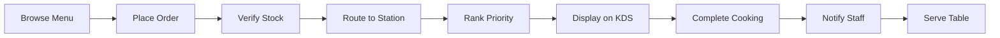
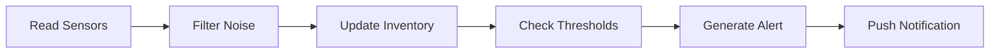
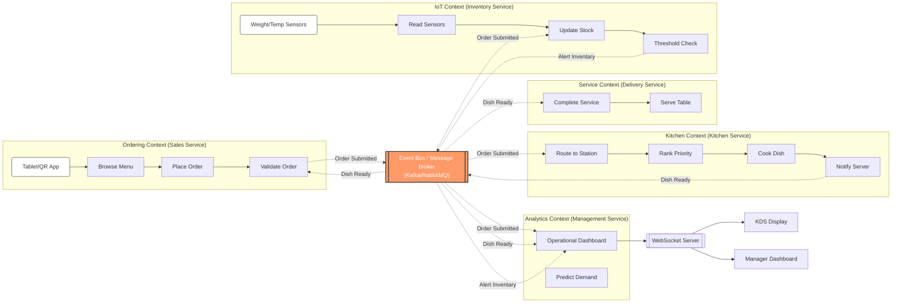
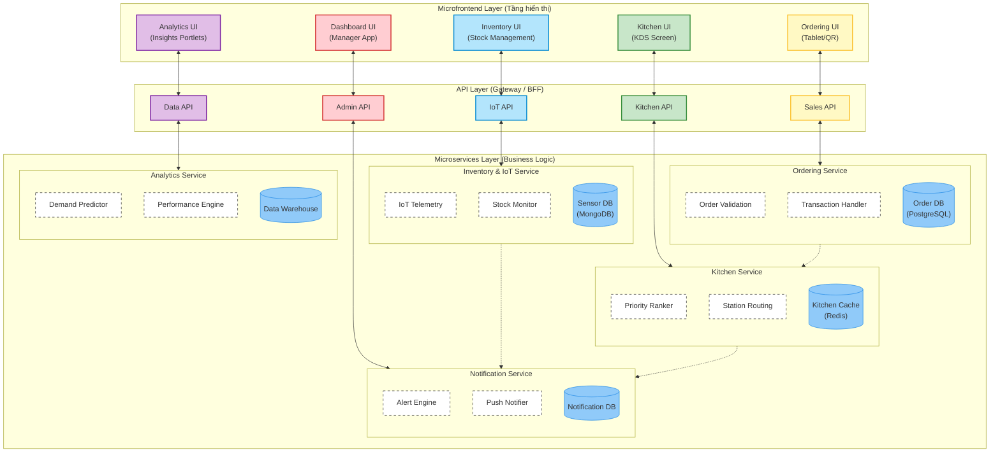
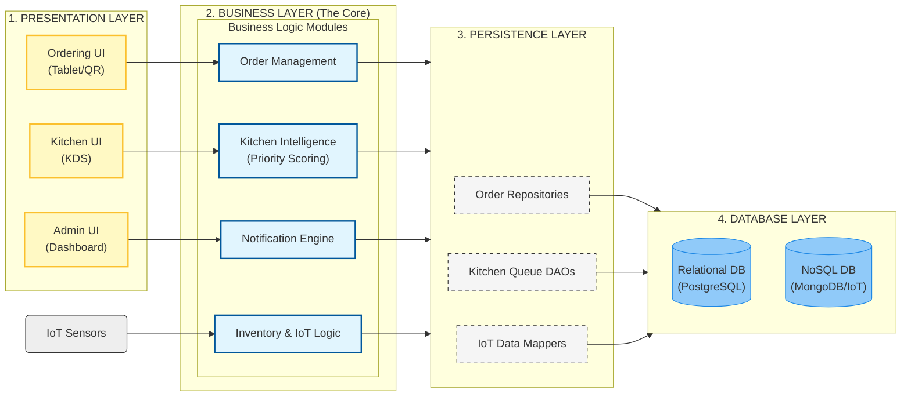
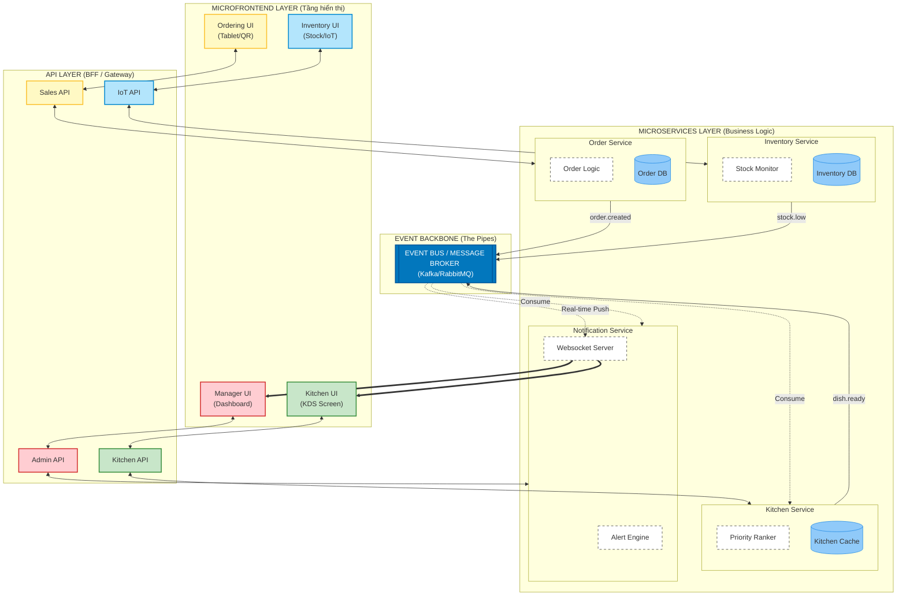
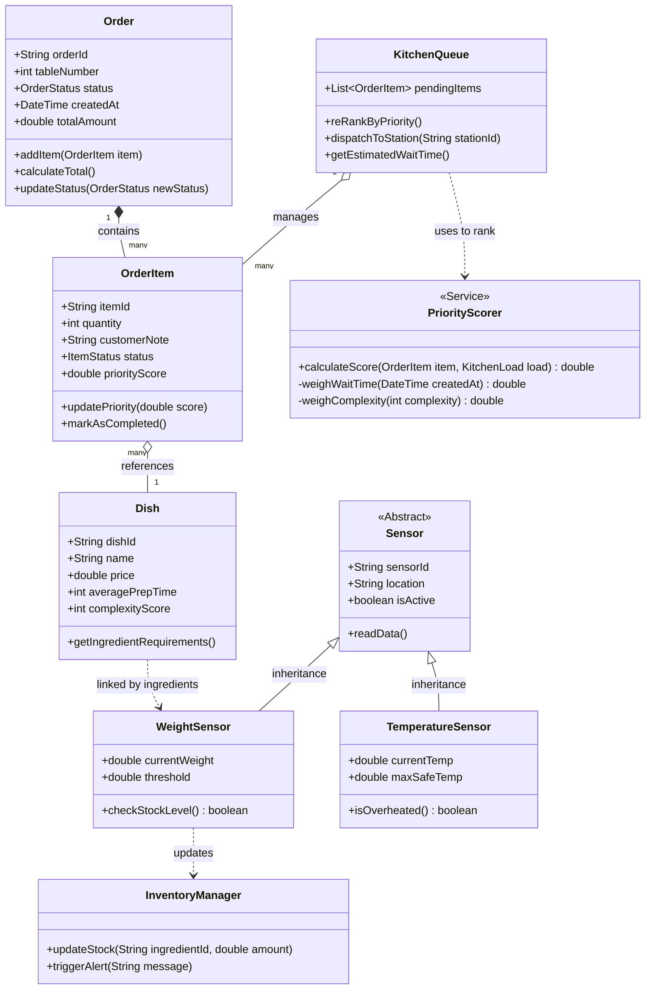

# IRIS

## Bối cảnh, yêu cầu, đặc tính kiến trúc, so sánh kiến trúc và quyết định thiết kế cho IRMS

## 1. Bối cảnh hệ thống IRMS

IRMS là một hệ thống quản lý nhà hàng thông minh ứng dụng **IoT** để tự động hóa quy trình gọi món, đồng bộ luồng xử lý giữa khu vực phục vụ và bếp, đồng thời tối ưu vận hành nhà hàng theo thời gian thực.

Trong hệ thống này, khách hàng có thể đặt món trực tiếp thông qua **tablet thông minh** hoặc **QR menu** mà không cần chờ nhân viên. Thông tin đơn hàng được gửi ngay vào hệ thống, sau đó được kiểm tra, phân loại món và chuyển đến đúng khu vực bếp tương ứng.

Song song đó, các thiết bị như **Kitchen Display System (KDS)**, **cảm biến trọng lượng nguyên liệu**, **cảm biến nhiệt độ tủ lạnh/tủ đông** liên tục gửi dữ liệu về hệ thống. Dựa trên các dữ liệu này, IRMS cập nhật hàng đợi chế biến, theo dõi tải của từng trạm bếp, giám sát tồn kho và hỗ trợ nhà quản lý ra quyết định thông qua dashboard thời gian thực.

## 2. Mục tiêu của hệ thống

Mục tiêu chính của IRMS là:

- tự động hóa quy trình đặt món
- đồng bộ đơn hàng giữa khu vực khách và bếp theo thời gian thực
- tối ưu hàng đợi bếp và phân bổ tải chế biến
- giám sát nguyên liệu và điều kiện bảo quản thực phẩm
- cung cấp dashboard vận hành và phân tích hỗ trợ quản lý

Từ đó, hệ thống hướng đến việc:

- nâng cao chất lượng phục vụ
- giảm thời gian chờ của khách
- giảm lỗi truyền đạt đơn hàng
- duy trì hiệu suất bếp ổn định, kể cả trong giờ cao điểm

## 3. Phạm vi hệ thống

IRMS bao gồm 4 phạm vi chính:

- **IoT-Based Ordering System**:
Khách hàng dùng tablet hoặc QR menu để xem menu và đặt món. Hệ thống tiếp nhận đơn, kiểm tra tính hợp lệ, phân loại món và gửi đến đúng trạm bếp.
- **Real-Time Order Queue Management**:
Đơn hàng được hiển thị trên KDS và cập nhật liên tục theo tiến độ nấu, tải hiện tại của bếp và mức độ ưu tiên phục vụ.
- **Inventory & Ingredient Tracking:**
Cảm biến trọng lượng giúp theo dõi lượng nguyên liệu còn lại; cảm biến nhiệt độ giúp kiểm soát điều kiện bảo quản thực phẩm an toàn.
- **Staff & Manager Dashboards:**
Dashboard hiển thị trạng thái đơn hàng, tải bếp, cảnh báo vận hành, mức tồn kho và các phân tích như luồng đơn, vòng quay bàn, thanh toán, dự đoán giờ cao điểm.

---

## 4. Functional Requirements – Yêu cầu chức năng

### 4.1. Đặt món qua IoT

Hệ thống phải cho phép khách đặt món thông qua tablet hoặc QR menu. Sau khi khách chọn món, hệ thống phải tiếp nhận đơn, kiểm tra dữ liệu đầu vào, xác nhận món hợp lệ và ghi nhận đơn hàng.

### 4.2. Phân loại và định tuyến đơn hàng

Sau khi đơn hàng được tạo, hệ thống phải tự động phân loại món theo nhóm như đồ uống, khai vị, món chính, tráng miệng và chuyển từng món đến đúng trạm bếp hoặc khu vực pha chế tương ứng.

### 4.3. Quản lý hàng đợi bếp theo thời gian thực

Hệ thống phải hiển thị đơn hàng trên KDS và cập nhật trạng thái liên tục. Hàng đợi cần được sắp xếp lại linh hoạt dựa trên độ phức tạp món ăn, công suất trạm bếp, thời gian chờ và cam kết phục vụ.

### 4.4. Cảnh báo cho nhân viên

Hệ thống phải gửi cảnh báo khi một món cần xử lý đặc biệt, khi trạm bếp quá tải, khi nguyên liệu gần hết hoặc khi nhiệt độ bảo quản vượt ngưỡng an toàn.

### 4.5. Theo dõi nguyên liệu

Hệ thống phải nhận dữ liệu từ cảm biến trọng lượng để theo dõi mức tiêu hao nguyên liệu và hỗ trợ cảnh báo khi nguyên liệu sắp cạn.

### 4.6. Theo dõi nhiệt độ bảo quản

Hệ thống phải thu thập dữ liệu từ cảm biến nhiệt độ tại tủ lạnh/tủ đông và cảnh báo khi giá trị vượt khỏi ngưỡng cho phép.

### 4.7. Dashboard vận hành

Hệ thống phải cung cấp dashboard cho nhân viên và quản lý để theo dõi trạng thái đơn hàng, tải bếp, tồn kho, cảnh báo và hiệu suất vận hành.

### 4.8. Phân tích và dự đoán

Hệ thống nên hỗ trợ phân tích dữ liệu như luồng đơn hàng, vòng quay bàn, thanh toán và dự đoán giờ cao điểm để hỗ trợ lên lịch nhân sự và tối ưu menu.

---

## 5. Non-Functional Requirements – Yêu cầu phi chức năng

### 5.1. Hiệu năng

Hệ thống phải phản hồi nhanh với các thao tác đặt món và cập nhật trạng thái đơn hàng gần thời gian thực (near real-time). KDS và dashboard cần phản ánh thay đổi gần như ngay lập tức.

### 5.2. Khả năng mở rộng

Hệ thống phải có khả năng xử lý số lượng lớn đơn hàng, nhiều thiết bị IoT và nhiều sự kiện đồng thời trong các khung giờ cao điểm mà không làm giảm đáng kể hiệu năng.

### 5.3. Độ tin cậy

Hệ thống phải bảo đảm dữ liệu đơn hàng, trạng thái bếp và dữ liệu cảm biến chính xác, nhất quán. Khi một thiết bị mất kết nối, hệ thống vẫn phải tiếp tục hoạt động ở mức chấp nhận được.

### 5.4. Khả năng chịu lỗi

IRMS cần tiếp tục vận hành ngay cả khi một số thiết bị IoT, cảm biến hoặc trạm bếp gặp sự cố. Lỗi cục bộ không được làm gián đoạn toàn bộ hệ thống.

### 5.5. Bảo mật

Hệ thống phải bảo vệ dữ liệu vận hành và đặc biệt là thông tin liên quan đến thanh toán. Việc xác thực, phân quyền và mã hóa dữ liệu là cần thiết.

### 5.6. Khả năng bảo trì và mở rộng

Kiến trúc hệ thống cần dễ sửa đổi, dễ thêm tính năng mới, dễ tích hợp thiết bị IoT mới hoặc bổ sung thuật toán tối ưu sau này.

---

## 6.1 Architecture Characteristics – Đặc tính kiến trúc quan trọng

Các đặc tính kiến trúc quan trọng nhất của IRMS là:

- **Real-time responsiveness**: vì đơn hàng, trạng thái bếp và cảm biến phải được cập nhật nhanh
- **Scalability**: vì số lượng đơn và thiết bị có thể tăng mạnh theo thời điểm
- **Fault tolerance**: vì hệ thống phải chịu được lỗi cục bộ từ thiết bị IoT hoặc dịch vụ
- **Interoperability**: vì phải tích hợp nhiều loại thiết bị và giao thức khác nhau
- **Maintainability**: vì hệ thống có nhiều module nghiệp vụ cần bảo trì độc lập
- **Extensibility**: vì nhà hàng có thể mở rộng thêm thiết bị, thuật toán hoặc tính năng phân tích
- **Security**: vì hệ thống có dữ liệu vận hành và thanh toán cần được bảo vệ

---

## 6.2 Workflow Components

#### Luồng business chính

#### Luồng giám sát thông minh: Từ cảm biến đến cảnh báo

## 7. So sánh các kiểu kiến trúc

### 7.1. Event-Driven Architecture

Kiến trúc hướng sự kiện phù hợp với hệ thống có nhiều sự kiện phát sinh liên tục từ tablet, QR menu, KDS và các cảm biến.

**Ưu điểm**

- phản ứng tốt với dữ liệu thời gian thực
- hỗ trợ bất đồng bộ, giảm phụ thuộc trực tiếp giữa các thành phần
- dễ tích hợp luồng cảnh báo, cập nhật KDS, dashboard và sensor stream

**Nhược điểm**

- khó debug hơn
- luồng xử lý có thể phức tạp hơn kiến trúc truyền thống
- cần broker/message infrastructure

### 7.2. Microservices Architecture

Kiến trúc vi dịch vụ chia hệ thống thành các dịch vụ độc lập như Order Service, Kitchen Service, Inventory Service, Alert Service, Analytics Service.

**Ưu điểm**

- dễ mở rộng độc lập từng module
- dễ bảo trì và phát triển theo domain nghiệp vụ
- phù hợp với hệ thống có nhiều chức năng rõ ràng

**Nhược điểm**

- triển khai và vận hành phức tạp hơn
- cần quản lý giao tiếp giữa các service
- tăng nhu cầu monitoring, tracing, service coordination

### 7.3. Layered Architecture

Kiến trúc phân lớp tổ chức theo UI, business logic, data access.

**Ưu điểm**

- dễ hiểu, dễ triển khai ban đầu
- phù hợp với hệ thống nhỏ và ít thay đổi

**Nhược điểm**

- kém phù hợp với bài toán nhiều sự kiện real-time
- khó scale độc lập từng phần
- không tối ưu cho môi trường IoT phân tán

---

### 7.4. Kết luận lựa chọn

Đối với IRMS, lựa chọn phù hợp nhất là:

**Event-Driven Architecture kết hợp Microservices Architecture**

Lý do là:

- IRMS là hệ thống có nhiều sự kiện phát sinh liên tục từ thiết bị IoT và thao tác người dùng
- các domain như đặt món, bếp, tồn kho, cảnh báo và dashboard có thể tách thành các module độc lập
- kiến trúc kết hợp này vừa đáp ứng xử lý thời gian thực, vừa hỗ trợ mở rộng và bảo trì lâu dài

---

#### Module view

## 8. Architecture Decisions – Các quyết định kiến trúc

### 8.1 Giao thức giao tiếp

- **MQTT** phù hợp cho cảm biến IoT vì nhẹ, tiết kiệm băng thông, hỗ trợ publish/subscribe
- **WebSocket** phù hợp cho KDS và dashboard vì cần cập nhật real-time hai chiều
- **HTTP/REST** phù hợp cho các API nghiệp vụ thông thường như quản lý menu, quản lý người dùng, báo cáo

### 8.2 Message Broker

- **RabbitMQ** phù hợp cho hàng đợi tác vụ và routing nghiệp vụ
- **Kafka** phù hợp cho event streaming quy mô lớn và analytics theo dòng

### 8.3 Cơ sở dữ liệu

- **SQL** **PostgreSQL** cho đơn hàng, thanh toán, menu, trạng thái nghiệp vụ vì cần tính nhất quán
- **NoSQL MogoDB** cho dữ liệu cảm biến
- **AWS S3** cho log sự kiện, telemetry

### 8.4 Logic ưu tiên KDS

Hệ thống cần một cơ chế ưu tiên đơn hàng thông minh, không chỉ theo thứ tự đến trước.

Các yếu tố nên đưa vào:

- độ phức tạp món
- thời gian chờ hiện tại
- tải của trạm bếp
- cam kết thời gian phục vụ
- tình trạng quá tải

**Giải Pháp**: sử dụng **priority score** để tính điểm ưu tiên và sắp xếp hàng đợi động.

### 8.5 Xử lý khi thiết bị IoT mất kết nối

**Giải pháp**:

- buffer tạm dữ liệu cục bộ
- retry khi kết nối được khôi phục
- đánh dấu trạng thái thiết bị offline trên dashboard
- cảnh báo cho nhân viên/quản lý
- không để lỗi một thiết bị làm dừng toàn bộ hệ thống

Áp dụng cơ chế **graceful degradation** và **store-and-forward** cho thiết bị IoT.

---

## 9. Design Principles – Nguyên tắc thiết kế

### 9.1. Loose Coupling

Các module không nên phụ thuộc chặt vào nhau. Ví dụ, Order Service không nên gọi trực tiếp Kitchen Service theo kiểu đồng bộ cho mọi tác vụ; thay vào đó nên giao tiếp qua event/message để tăng linh hoạt.

### 9.2. Separation of Concerns

Mỗi module chỉ nên tập trung vào một trách nhiệm chính:

- Order Service xử lý đơn hàng
- Kitchen Service xử lý hàng đợi bếp
- Inventory Service xử lý nguyên liệu
- Alert Service xử lý cảnh báo
- Dashboard Service hiển thị và tổng hợp dữ liệu

### 9.3. Fail-Safe Defaults

Khi có lỗi hoặc mất kết nối, hệ thống phải chuyển sang trạng thái an toàn:

- thiết bị offline thì báo lỗi rõ ràng
- dữ liệu chưa gửi được thì lưu tạm
- không tự động thực hiện hành động rủi ro khi thiếu dữ liệu

### 9.4. Extensibility

Hệ thống  được thiết kế để dễ bổ sung thiết bị IoT mới, loại cảm biến mới hoặc logic phân tích mới mà không cần sửa toàn bộ hệ thống.

### 9.5. Observability

Hệ thống cần hỗ trợ logging, monitoring và alerting để quản lý trạng thái dịch vụ, message flow và lỗi thiết bị.